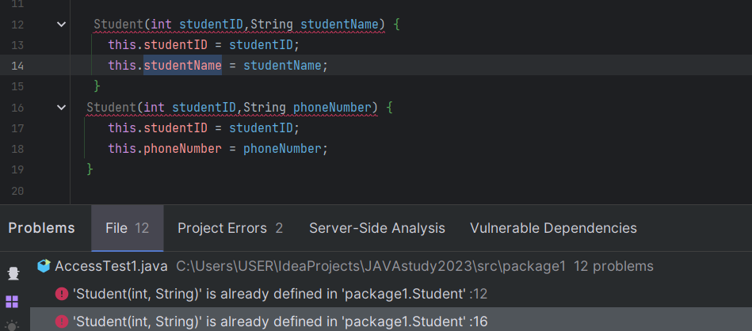

# step2 스프링부트 생성과 간단한 작동원리 이해하기
먼저 해당 브랜치에 자신의 영문 디렉토리를 만들고 가장 상위의 example과 README.md 파일을 자신의 디렉토리에 copy+paste 하여 과제를 진행해주세요
## 실습 과제
아래의 설명을 따라서 적절한 버전과 dependency를 추가하여 spring initializer로 프로젝트를 생성한다.

### 스프링부트 프로젝트 생성하기

Spring Initalizer 링크 (IntelliJ 내에서 생성해도 좋다.)


https://start.spring.io/


#### 이 스터디는 아래와 같은 버전으로 진행한다.

- Spring Boot 3.1.2
- Gradle-Groovy
- Java 17

위와 같은 세팅으로 설정한다. 추후에 추가 가능하니 
스프링부트나 JDK, Java의 경우에는 여러가지 버전이 존재하고 그 사이에서 자유롭게 선택이 가능하다.

#### 차이가 뭘까?

  - 현재로서는 차이를 조사하여도 체감이 되는 부분은 없다.
  - 예로 들면 자바 17부터는 레코드를 지원하기에 이를 이용하지 않을거면 굳이 스프링부트 3.x 버전과 아직 불안정한 스프링 시큐리티 6.x를 사용할 필요가 없으니 스프링부트 2.x와 시큐리티 5.x 버전을 이용하자 라는 생각을 가질수 있다.
  - 실제로 많은 회사에서 아직 3.x로의 버전업을 진행하지 않은 이유도 시큐리티 6.x 의 불안정함 때문이라고 한다.
  - 하지만 이 스터디를 진행하는 인원들은 대부분이 처음 접하는 경우이기 때문에 3.x 버전을 사용하여 취직할 타이밍에 사용할 버전을 준비하는것이 좋을것 같다고 생각이 들어 이렇게 진행하게 되었다.

#### 추가적으로

당연히 MetaData의 Group, Artifact, Name 등은 고쳐주자

### Dependencies

- Lombok ; Entity를 선언하는데 필요한 어노테이션을 통해 자동완성을 해준다.
- Spring Web ; servlet 리스너, 파일 업로딩 IoC 초기화 등 기능과 HTTP 클라이언트와 소통(REST api)에 필요하다.
- Spring Data JPA ; 자바의 객체-관계형 데이터베이스 매핑 기술(ORM)
- Spring Security 
- Validation ; Entity를 선언시에 해당 기능으로 쉽게 객체 필드에 대한 제약조건을 설정할수 있다.
- MySQL Driver ; MySQL DB와 연결하기 위한 드라이버

  
다운로드 후 해당 레포지토리에 스터디 규칙을 지켜서 자신의 영문이름으로 폴더를 만들고 안에 압축 해제를 한다.

#### 🤔 궁금증
위의 내용은 이 프로젝트에 있는 라이브러리에 대한 설명인가요?
그런데 build.gradle의 파일 dependencies에는 MySQL Driver 내용이 없습니다.

## 최종적으로는
#### Generate 후 적절한 JDK 설정과 docker-compose로 만들어진 docker 위의 mySQL과 연결까지 해봅시다!
이전에 example에 있는 assignment01을 실행하여 아래와 같은 결과가 나오는지 확인해봅시다.


*만약 제대로 실행이 되었지만 아래와 같은 오류가 발생한다면 일단은 괜찮습니다. step 3에서 마저 진행하도록 하겠습니다.


# 개념 과제
## 📕 객체 지향언어, 자바
자바는 **"객체지향언어"** 다.
객체 지향 프로그래밍이란,  객체를 먼저 정의하고 각 객체가 어떤 기능을 제공하고 객체 간 협력을 어떻게 구현할 것인지를 고민하는 것이다.

**자바에서 객체간 협력을 구현하는 방법**
클래스 메소드 내에서 다른 클래스의 메소드를 사용하여 구현할 수 있다.

## 📕 클래스와 객체, 인스턴스
### 📖 객체
(이 부분에 대해서는 제가 고민을 좀 해봤는데 맞는 내용인지 잘 모르겠습니다.)
객체는 자동차, 사람, 책과 같은 물리적인 것일 수도 있고, 주문이나 배송처럼 개념적인 것일 수도 있다.
자바는 이런 객체의 기능과 속성의 틀을 클래스로 구현하고, 클래스를 실제 메모리에 생성하여 인스턴스를 만들 수 있다.
클래스는 객체의 틀이라고 하고, 인스턴스를 객체라고 할 수 있는데, 내가 이해한 바로는 
객체라는 뜻은 코드로 구현된 것보다는 개념적인 단어이고, 인스턴스는 코드와 메모리로 실제 구현된 것만을 말한다.
객체를 소프트웨어에 실체화를 하면 그것을 인스턴스라고 말한다.

### 📖 클래스
객체의 속성과 기능을 코드로 구현한 것이다. 

- 클래스는 속성(변수)와 기능(메서드)를 가질 수 있다.
- 각각의 변수와 메서드는 다양한 접근제어자를 가질 수 있고, static이란 예약어를 가질 수 있다.

#### 📒 인스턴스 변수, 정적 변수
- 사용되는 메모리 공간과 공유여부에 따라서 인스턴스 변수와 정적 변수로 구분할 수 있다.

**인스턴스 변수**
`static`이란 예약어없이 클래스 내부에 선언되어 객체 속성을 나타낸다.

- 인스턴스 변수는 인스턴스마다 별도의 메모리 공간을 가지고 따라서 공유되지 않는다.
- 인스턴스 변수는 힙메모리 공간에 저장된다.

접근 방법
`참조변수.변수명`
**정적 변수**
클래스의 변수에 `static`이란 예약어가 붙는다. 클래스변수나 static 변수라고도 한다.

- 인스턴스 변수와 다르게 메소드 영역 메모리 공간에 할당되어 모든 인스턴스가 하나의 정적변수를 공유한다.
- 인스턴스와 저장되는 공간이 다르기 때문에 인스턴스가 생성되기전에 사용하고 접근할 수 있다.

접근 방법
`클레스명.변수명`

#### 📒 변수의 자료형
기본 자료형, 참조 자료형이 있다.

- 기본 자료형 : 원시 자료형(int, double)
- 참조 자료형 : 원시 자료형이 아닌 클래스나, String, 인터페이스가 있다.

#### 📒 클래스의 메서드
객체의 기능을 구현한 것으로, 매개변수나 반환값을 가질 수 있다.
변수와 마찬가지로 static이 붙은 정적 메서드와 인스턴스 메서드로 구분된다.

**인스턴스 메서드**
인스턴스로 생성되어야지만 접근하고 사용할 수 있다.

- 인스턴스 변수와 정적 변수 모두를 사용할 수 있다.

**정적 메서드, 클래스 메서드**
객체를 생성하지 않고도 사용할 수 있다.
⚠️ 인스턴스가 생성되지 않아도 사용할 수 있어야하기 때문에, 인스턴스가 생성되어야지만 접근할 수 있는 인스턴스 변수는 올 수 없다.
### 📖 인스턴스
클래스가 메모리(힙메모리)에 생성된 상태

- 하나의 클래스로 여러 인스턴스를 만들 수 있다.
- 클래스가 생성될때마다 새로운 힙 메모리 공간에 부여되고, 클래스의 멤버변수는 각각의 메모리 공간을 가진다.

#### 📒 인스턴스의 생성방법
```java
  //(클래스 자료형) 참조변수 = new 생성자;
  Student seohyun = new Student();
```
new Student() = 생성된 인스턴스의 힙메모리 주소 값
seohyun = 생성된 인스턴스의 힙 메모리 값이 대입된다.
이때 seohyun을 객체의 주소를 저장해 참조 변수라고 한다.

### 📕 생성자
클래스명과 동일하고 매개변수를 가질 수 있으며 반환값이 없고 상속되지 안흔다.

#### 📒 디폴트 생성자
클래스 내에 생성자를 명시적으로 작성하지 않았을 때, 컴파일러가 자동으로 생성해주는 생성자이다.
매개변수가 없고, 수행문이 없다.
생성자가 하나라도 있는 경우에는 디폴트 생성자를 컴파일해주지 않는다.

**🤔 디폴트 생성자의 접근제어자는?**
클래스의 접근제어자를 따라간다. 
👉 public 클래스에 아무런 생성자를 선언하지 않으면 디폴트 생성자가 public 생성자로 자동 컴파일 되어
다른 패캐지에서 생성이 가능하지만,
public 접근제어자로 선언한 클래스에 default 생성자를 생성하면 다른패키지에서 정상 생성이 안되는 것을 확인할 수 있다.

**생성자 오버로딩**
생성자를 두개 이상 제공하는 경우
⚠️ 디폴트 생성자를 자동 컴파일 해주지 않는다.

### 📕 상속과 상속의 활용
자식 클래스가 부모 클래스를 `extends`의 예약어를 통해 상속받을 수 있다. 
하위 클래스는 상의 클래스의 멤버변수와 메소드를 상속받을 수 있다.

**상위클래스의 생성자**
🤔 하위 객체를 생성할 때 상위객체의 멤버변수와 메소드를 쓸 수 있는 건 알았다.
그런데 어떻게 쓸 수 있는 걸까?
➡️ 하위클래스 생성자에서 자동으로 상위클래스 생성자를 컴파일 하기 때문이다.

#### 📒하위클래스내에서 상위클래스생성자 호출 규칙
1. 상위클래스의 생성자는 super 예약어를 사용한다.
2. 상위클래스 생성자는 첫줄에 위치해야한다.
3. 상위클래스 생성자에 매개변수가 있는 직접만든 생성자라면, 하위클래스에서 직접 생성자를 추가해야한다.
4. 하위클래스에서 상위클래스생성자의 매개변수를 받아야한다. 
```java
class Extend0 {
  //상위클래스에 매개변수가 있는 경우 → 명시적으로 상위생성자 추가 필요
  public Extend0(int i) {
  }
}
class Extend1 extends Extend0 {
//하위클래스에서 상위클래스 생성자를 super예약어를 통해 작성
    public Extend1(int i) {
    //첫 줄에 작성 & 동일한 타입의 매개변수
    super(i);
}
```
### 📖 업 캐스팅 (상위클래스로 묵시적 형변환)
하위클래스의 인스턴스를 상위클래스로 클래스 형변환하여 사용할 수 있다.
```java
//상위클래스 클래스명 = new 하위클래스의 생성자;
Extend0 e = new Extend1();
```
📒 상위클래스로 형변환 한 경우
상위클래스의 멤버 변수, 메소드 👉 사용할 수 없음
생성클래스의 멤버 변수, 메소드 👉 사용할 수 없음
생성클래스에서 상위클래스의 메서드가 오버라이딩 된 경우 👉 사용할 수 있음
: 상위클래스의 메서드가 하위클래스에서 오버라이딩 되었을 때 호출되는 메소드는
생성된 인스턴스 메소드를 호출한다. (가상메서드)

## 📕 접근제어자의 종류와 특징
#### 📒 접근제어자 : public
외부 클래스 어디에서나 접근할 수 있다.
내부 패키지도 접근할 수 있다.

클래스의 풀 네임은 소속패키지이름.클래스명까지이다.
따라서 다른 패키지에서 접근할 때는 패키지이름.클래스명으로 풀네임을 쓰던지 import예약어를 쓴다.
```java 
import side1.Protected;
```
#### 📒 접근제어자 : protected
외부클래스여도 상속관계클래스라면 접근할 수 있다.
같은 패키지 내부에서 접근할 수 있다.

#### 📒 접근제어자 : default
같은 패키지내에서 접근 할 수 있다.
따로 정의할 필요는 없고 기본으로 적용된다.

#### 📒 접근제어자 : private
같은 클래스 파일에서만 접근할 수 있다.
👉 메소드를 통해서 변수 값 변경가능


## 📕 ORM
Object Relational Mapping : 객체 관계 매핑
애플리케이션 Class와 RDB의 테이블을 연결하는 것이며, 애플리케이션의 객체를 
RDB 테이블에 자동으로 영속화해주는 것이다.

#### 📒 객체 - 관계 불일치의 이유
1. **세분성**
데이터 베이스에 있는 테이블 수 보다 더 많은 클래스를 가진 모델이 생길 수 있다.
2. **상속성**
RDBMS는 객체 지향 프로그래밍언어의 특징인 상속 개념이 없다.
3. **일치**
RDBMS는 PK를 사용하여 동일성을 정의한다.
그렇지만 자바는 객체 식별(==)과 객체 동일성(eqauls)을 모두 정의한다.
4. **연관성**
객체 지향언어는 방향성이 있는 객체의 참조를 사용하여 연관성을 나태지만
RDBMS는 방향성이 없는 FK를 이용해서 나타낸다.
5. **탐색**
자바는 그래프형태로 하나의 연결에서 다른 연결로 이동하여 탐색하지만, 
RDBMS에서는 일반적으로 SQL문을 최소화하고 JOIN을 통해 
여러 엔티티를 로드하고 원하는 대상 엔티티를 선택하는 방식으로 탐색한다.

### 📖 JPA란
자바에서 ORM 기술 표준으로 사용되는 인터페이스의 모음이다.
RDBMS를 구현된 클래스와 매핑을 해주기 위해 사용되는 프레임워크이고, 대표적인 오픈 소스로는 Hibernate가 있다.

### 📖 JPA를 사용한 코드
JPA는 Java 객체와 테이블을 매핑시키는 ORM 기술이므로 다음과 같이 Java 클래스에 매핑 정보를 넣어주어야 한다.

#### 📒 1번 코드
데이터 베이스의 user테이블과 연결되는 User엔티티 클래스 정의
```java
@Entity
@Table(name = "user")
@Getter
@Builder
@NoArgsConstructor(force = true)
@AllArgsConstructor
public class User extends BaseEntity {

    @Id
    @GeneratedValue(strategy = GenerationType.IDENTITY)
    private Long id;

    private String email;
    private String name;
    private String pw;
}
```

#### 📒 2번코드
JpaRepository를 상속받는 UserRepository 인터페이스

JpaRepository의 제네릭 타입 지정
<엔티티, 엔티티에서 사용할 PK데이터 타입>
아래 코드에서는 User 엔티티와 PK데이터 타입인 Long 사용

`JpaRepository 인터페이스`
기본적인 CRUD(Create, Read, Update, Delete) 작업을 지원하는 스프링 데이터 JPA의 인터페이스

```java
public interface UserRepository extends JpaRepository <User, Long> {
}
```
**리포지토리란**
애플리케이션 소스 코드에 대한 변경을 수행 및 관리하는 데 사용하는 중앙화된 디지털 스토리지

#### 📒 3번 코드
Spring Framework의 @Service 어노테이션을 이용하여 비즈니스 로직을 처리하는 UserService 클래스를 정의한 것

```java
@Service
@RequiredArgsConstructor
@Transactional(readonly = true)
public class UserService {

    private final UserRepository userRepository;

    @Transactional
    public User findUserAndUpdateName(Long id) {
        User user = userRepository.findById(id);
        user.setName("변경된 이름");
    }
}
```


# Example을 보고 실시한다.
## example/생성자와_메서드

```
// 인스턴스 생성
Car myCar = new Car("Hyundai", "G80", 2022);
```
에서 자바의 new 키워드를 이용해 인스턴스를 생성하는 메서드를 호출한다.

그럼 자바는 Car.java로 이동하여 Car 클래스 내부의 클래스명과 같은(Car) 생성자를 이용해 인스턴스를 생성하게 된다.

#### /Car.java 과제
  1. 만약 Car.java에서 생성자를 지우게 된다면 인스턴스는 생성되지 않게 될까요? 생성된다면 왜 생성이 되는걸까요?
   - 기본 생성자에 대해서 알아보세요.
    >위에서 설명
  2. 현재 생성자에서 speed를 0으로 따로 초기화 해주고 있는데 이를 지우게 된다면 어떻게 될까요?
     - 기본 초기화에 대해서 알아보세요
      ```
      원시자료형의 기본 값으로 초기화되고, 참조 자료형의 경우 null으로 초기화 된다.
      숫자형은 0이나 0.0f, char : 공백문자 ' ', boolean : false
      ```
     - 기본 데이터 타입과 참조 데이터 타입의 차이에 대해서 알아보세요.
       ```
       참조 데이터 타입은 메모리 주소 값을 가지고, 기본 타입은 실제 값을 가진다.
       원시 자료형인 int는 실제 숫자값을 가지지만 참조 데이터 타입은 Integer은 주소값을 가진다.
       ```
  3. 반대로 생성자를 여러개 생성하는 생성자 오버로딩에 대해서 알아보세요
   - 생성자 오버로딩시 주의해야할 점에 대해서 알아보세요.
    ```
    생성자를 오버로당한 경우 디폴트 생성자가 자동 컴파일 되지 않는다.
    ```
     4. 만약 두 생성자가 매개변수의 개수와 형식이 동일하다면 어떤 오류가 발생할까요? (직접 코드를 작성해보면 좋습니다.)
     
     생성자의 매개변수 명으로 구분하는 것이 아니라, 생성자의 매개변수 개수와 자료형으로 구분한다.
     따라서 이미 있는 생성자라고 오류메시지가 뜬다.

5. *혹시 가능하다면 생성자 오버로딩을 구현해봅시다!
#### 🤔 궁금한 점
Car.java파일에 보면 매개변수가 3개인 생성자 구현 코드를 보면
speed를 0으로 명시적인 초기화를 하는 문장이 있더라구요
speed은 int형으로 따로 초기회를 하지 않아도 0으로 초기화가 될 텐데 명시적으로 초기화를 하는 이유가 있을까요?
단순히 코드의 가독성과 혹시모르는 오류때문일까요?
또 앞으로의 코드 작성에 있어서도 따로 매개변수를 받지 않아도 멤버변수를 초기화하는 코드를 작성하는 것이 좋을지 궁금합니다.

👉저는 작성시에 이 생성자는 속도를 0으로 지정하는 생성자라는 의미를 보여주고 싶었습니다 일종의 가독성이라고 보면 좋겠네요. 
비슷한 질문을 현업에서 일하시고 있는 분께 한적이 있는데 그분께서는 코드가 한줄 늘어나는 것과 
혹시 잘못이해하거나 실수해서 오류가 나중에 발생하고 그걸 디버깅하는 위험을 감수하는 것 둘중 어떤경우가 더 영향이 크지 생각 해보라고 하시더라고요 
트레이드오프 관계가 아닌가 싶네요😁😁 예리하십니다

💭 코드의 의도에 대해서 생각해보았는데요.
민기님께서 속도를 0으로 지정하는 생성자라는 의도를 가지고 있었다면 의도대로 작동하고 제가 의도대로 이해했으니 잘 작성된 코드라고 생각했습니다.
의도가 불분명한 코드는 잘못이해하고 실수할 여지가 생기기 때문에 의도를 명확히 하는 것이 좋다고 생각해보았습니다.
또 코드 한줄 늘어나는 것이 위험 요소가 생기는 것보다는 훨씬 좋은 것 같습니다.☺️ ️

        ``` 
        // 기본 생성자
            public Car() {
                // TODO: 필드를 기본값으로 초기화
            }

            // 매개변수가 3개인 생성자
            public Car(String make, String model, int year) {
                // TODO: make, model, year 초기화, speed는 기본값으로 초기화
            }

            // 매개변수가 4개인 생성자
            public Car(String make, String model, int year, int speed) {
                // TODO: 모든 필드 초기화   
            }
        ```

#### /Main.java
  1. 기존에 만든 mycar 인스턴스 대신에 새로운 자동차를 만들어주고 그 자동차의 속도를 100으로 설정해주는 코드를 작성해주세요.
>생성자에서 초기화를 하는걸 뜻하는 건가요?
  2. 생성자 오버로딩을 구현해보았다면 초기 속도가 100인 자동차의 인스턴스를 만들어보고 emergencyBrake라는 메서드를 만들어 한번에 속도를 0으로 줄이는 메서드를 적용시켜봅시다.
     

### example/
- 왜 OOP에서는 인스턴스를 만들어 사용할까?
## OOP에서 인스턴스를 생성하는 이유
OOP란 객체 지향 프로그래밍(Object Oriented Programming)이다.
-> 추상화를 위해서..?

**추상화**
어떠한 것을 표현할 수 있는 공통된 특징과 속성을 파악하여 표현하는 것을 말한다.
객체들의 공통된 특성을 가지고 클래스를 만들 수 있다.

- private 멤버에 대한 public 접근자 메서드를 왜 따로 만들어줄까?
  - private 멤버 변수에 직접 접근할 수 없을 때, 어떻게 값을 읽고 변경할 수 있게될까?
## public 접근자 메소드를 따로 사용하는 이유 
1. 캡슐화를 위해서
   public 메서드를 통해서 클래스 내부 데이터를 외부로 노출하지 않고 클래스의 상태와 동작을 조작할 수 있다.

2. 데이터 무결성 유지
public 메서드를 통해 데이터에 접근하고 수정하면, 해당 클래스 내에서 데이터의 유효성 검사와 처리를 수행할 수 있다. 
이를 통해 잘못된 데이터의 입력을 방지하고 데이터 무결성을 유지할 수 있다.

### private의 값을 읽고 변경할 수 있게될까?
private 접근제어자는 접근을 해당 클래스 내부에서만 허용한다.
따라서 클래스 내부에 private 멤버 변수의 값을 접근하고 변경하는 메서드를 구현해서 사용한다.

#### 🤔활용 방법
문제 상황 : 클래스 변수를 바꾸는 것에 조건이 필요할 때 ex) 꼭 25이상으로만 해야함!
해결 방법 : 다른 클래스에서 접근할 수 있는 메소드를 사용해서 변수 값 설정을 통제할 수 있다.

```java
class  PrTest {
//변수의 값을 5~10의 값으로만 유지하고 싶음.
private int privateint;
int i;

	void set(int input) {
		if((5<=input)&&(input<=10)) {
			this.privateint = input;
			System.out.println("privateint값 " + this.privateint);
		} else {
			System.out.println("privateint값은 5~10의 값만 적용된다.");
		}
	}
}
```